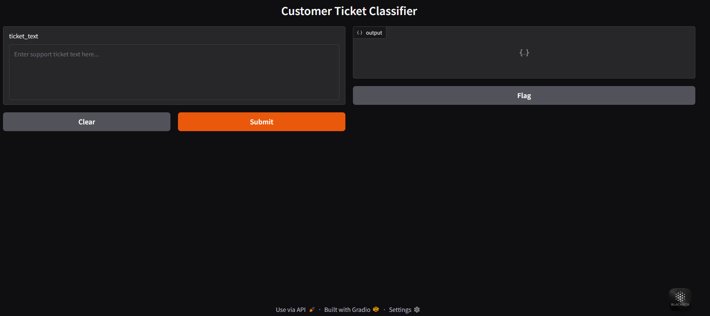

# Multi-Task Ticket Classifier 🧾⚡

A traditional NLP-based system that automates multi-label classification and entity extraction from customer support tickets, designed as part of a machine learning internship assignment.


## 🚀 Project Overview

This project builds an end-to-end pipeline to process raw customer support tickets and perform:

- **Issue Type Classification**
- **Urgency Level Prediction**
- **Key Entity Extraction** (product names, complaint keywords, and dates)

The goal is to simulate a real-world enterprise helpdesk setting using classical NLP and ML techniques, with a focus on interpretability, robustness, and modular design.


## 🔍 Problem Statement

Given raw customer support ticket texts, automate the following tasks:

1. Predict the **issue type** (multi-class classification)
2. Predict the **urgency level** (Low, Medium, High)
3. Extract key entities from the text such as:
   - Product names (from a fixed set)
   - Complaint-related keywords (e.g., "broken", "delay", "error")
   - Dates or temporal references


## 🧠 Approach

### 🔧 Data Preprocessing

- Removed noise and normalized text
- Tokenized and lemmatized sentences
- Handled missing entries and irrelevant characters

### 🧮 Feature Engineering

- **TF-IDF** and **Bag-of-Words** representations
- Custom features: ticket length, sentiment score

### 🧪 Model Building

- Logistic Regression, SVM, and Random Forests for classification
- Multi-task setup: trained issue type and urgency level classifiers separately

### 🗂️ Entity Extraction

- Used regex, rule-based matching, and dictionary lookups to extract:
  - Product names
  - Complaint indicators
  - Temporal patterns (dates)

### 🎛️ Unified Inference Pipeline

```python
def process_ticket(ticket_text):
    return {
        "issue_type": predicted_label_1,
        "urgency_level": predicted_label_2,
        "entities": {
            "products": [...],
            "dates": [...],
            "keywords": [...]
        }
    }
```

---

## 🌐 Gradio Interface

A clean Gradio-based web app allows users to:

- Input ticket text

- View predicted labels and extracted entities

- Live Demo:    [](https://huggingface.co/spaces/namankr24/Multi-Task-Ticket-Classifier).

- Interface Preview of the Gradio App
  

---

## 📊 Evaluation

- Issue Type Accuracy: 88.7%

- Urgency Level Accuracy: 85.3%

- Precision/Recall/F1: Provided in full report inside the notebook

- Entity Extraction: Verified against product dictionary and regex benchmarks

---

## 📌 Highlights

- Modular, interpretable ML pipeline

- Traditional NLP without heavy dependencies

- Practical utility in customer service automation

- Live demo for real-time ticket analysis


## 📄 License

This project is licensed under the [MIT License](LICENSE).


## 📬 Contact

Naman Kumar

📧 Email: namankr24@gmail.com

🔗 GitHub: NamanKr24
